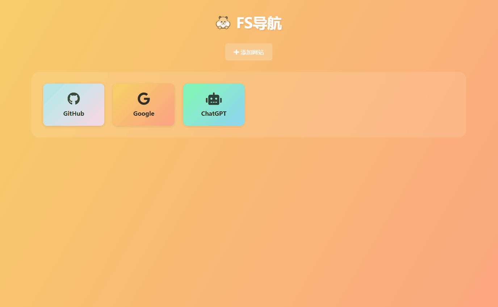

# FS导航

一个简洁美观的个人导航页面，基于 Vue 3 + TypeScript + Vite 构建。支持自定义网站、图标和端口，使用 localStorage 持久化存储数据。

## 功能特点

- 🎨 美观的渐变色卡片设计
- 📱 响应式布局，支持移动端
- ⚡ 快速添加/删除网站
- 🔍 支持自定义图标（基于 Font Awesome）
- 🌐 支持 HTTP/HTTPS 协议选择
- 🔌 支持自定义端口
- 💾 本地存储，无需后端
- 🐳 Docker 支持，一键部署

## 使用说明

1. 添加网站：
   - 点击"添加网站"按钮
   - 输入网站名称
   - 选择 HTTP/HTTPS 协议
   - 输入域名或 IP 地址
   - 可选：输入端口号
   - 选择图标
   - 点击"添加"确认

2. 删除网站：
   - 将鼠标悬停在网站卡片上
   - 点击右上角的删除按钮
   - 确认删除
### 演示

